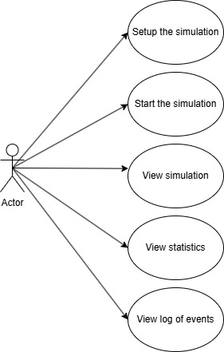

# Multi-Threaded Queue Management System

A Java simulation designed to analyze and optimize waiting times in multi-queue service environments. This project focuses on **Concurrency**, **Thread Synchronization**, and **Layered Software Architecture**.
*Developed for the Programming Techniques course at the Technical University of Cluj-Napoca.*

## 📽️ Simulation Overview

*Visualizing real-time customer distribution across multiple service threads.*

## 🚀 Key Features

* **Real-Time Simulation**: Models customer arrival and service processes using independent execution threads.
* **Dynamic Load Balancing**: Implements a strategy to assign customers to the queue with the shortest waiting time.
* **Performance Analytics**: Generates detailed logs (available in `result.txt`) tracking average waiting time, average service time, and "peak hour" metrics.
* **Configurable Parameters**: Allows project managers to adjust the number of queues, arrival time intervals, and service time ranges via the GUI.
* **Comprehensive Performance Statistics**: Automatically calculates and displays critical metrics including Average Waiting Time, Average Service Time, and "Peak Hour" identification to evaluate system efficiency.

## 🛠️ Technical Highlights

* **Multithreading & Concurrency**: Utilized `Thread` objects and `BlockingQueue` for thread-safe customer handling and synchronization.
* **Modular Architecture**: Organized into distinct layers: businessLayer` for simulation logic, `dataAccessLayer` for log generation, and `presentation` for the Swing GUI.

## 🧠 Lessons Learned - Key Takeaways
* **Testing & Validation**: Validated the simulator against multiple scenarios (`test1.txt`, `test2.txt`, `test3.txt`) to ensure accuracy in heavy-load environments.
* **Responsive UI**: Learned to separate the simulation engine from the GUI thread, ensuring the dashboard remained interactive while processing heavy background computations.
* **Modular Codebase**: By organizing code into specific packages, I practiced building scalable software where components can be tested and modified independently.
